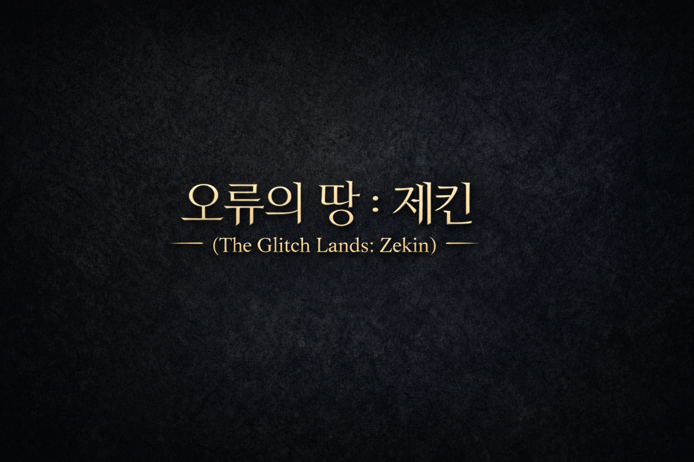
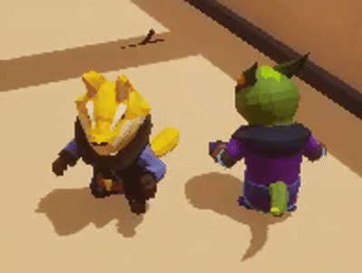

# 안녕하세요, sidsru입니다

 

## 팀 프로젝트

<table>
  <tr>
    <th width="50%">
      <a href="https://github.com/sidsru/5th_6th-Team4-CH6-Project.git">오류의 땅, 제킨(Zekin)</a>
    </th>
    <th width="50%">
      <a href="https://github.com/NBcampUnrealTrack/5th_6th-Team3-CH4-Project.git">Pettt Animals</a>
    </th>
  </tr>
  <tr>
    <td width="50%">
      
    </td>
    <td width="50%">
      
    </td>
  </tr>
  <tr>
    <td width="50%">담당 역할: 캐릭터 플레이 로직, 캐릭터 콤보 공격, 캐릭터 기능 전반</td>
    <td width="50%">담당 역할: 인게임 로직, InGame UI 제작, 승패 판정 로직 구현</td>
  </tr>
</table>

 

## 개인 프로젝트

| [ProjectFP](https://github.com/sidsru/ProjectFP.git) |
| --- |
|  |

## 사용 기술

### Game Client

### Development Tools

### Collaboration

 

## 연락

- GitHub: [sidsru](https://github.com/sidsru)
- Email: sidsru21131210@Gmail.com
- x : [sidsru](https://x.com/kGqiopF34daF87s)
- blog : [sidsru](https://sidsru.github.io/)
- Portfolio : [sidsru](https://sidsru.github.io/portfolio/)
